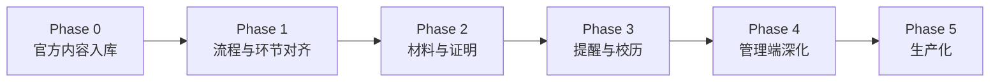

# 党团平台落地升级路线（Plan）

> 目标：从「演示功能 + 占位文案」升级为「依托学院官方文件、可日常使用的党团事务平台」。  
> 依据材料：`党团平台官方文件/`（发展党员程序图、2025-2026 校历）、`党团平台文件 2/`（党员/团员证明模板）。

---

## 一、现状与差距

| 维度 | 演示版（升级前） | 落地版目标 |
| --- | --- | --- |
| 流程定义 | 5 个粗粒度阶段，文案简略 | 对齐官方 **5 阶段 · 29 环节** 程序图 |
| 官方文件 | 无真实附件 | 流程图 PNG、校历 PNG、证明 Word 可下载/预览 |
| 知识库 | 1 条党团摘要 | 流程说明、校历要点、证明办理、积极分子材料清单 |
| 理论自测 | 8 道演示题 | 基于细则与官方流程的题库（可 CSV 导入扩展） |
| 入团 | 仅小程序 mock | Web + API 双轨入团进度 |
| 管理端 | 仅推进入党阶段 | 入党/入团分别推进，进度一览含环节完成度 |

---

## 二、分阶段路线图



### Phase 0 — 官方内容入库 ✅（本次已完成）

**交付物**

- `backend/assets/party/`：4 个官方文件（流程图、校历、党员/团员证明模板）
- `backend/app/services/party_official_data.py`：29 环节、校历要点、知识库正文、理论题
- `backend/app/services/party_bootstrap.py`：启动/迁移时自动 upsert 阶段、规则、知识库、模板、题库
- API：`GET /api/party/official-docs`、环节完成 `POST /api/party/steps/{id}/done`
- API：`GET /api/league/progress`、入团环节完成、管理端推进入团阶段
- 前端：`PartyView` 入党/入团页签、官方文件下载预览、当前阶段环节清单

**验收**

- [ ] 重启 `student-service` 后，知识库可搜到「发展党员工作程序」「校历」「证明办理」
- [ ] 党团页可下载流程图、校历、证明模板
- [ ] 学生账号可见 29 环节中「当前阶段」子集并可勾选
- [ ] 管理老师可在工作台推进入党/入团阶段

**部署命令（云服务器）**

```bash
cd /opt/student_service/software_team
git pull
# 确认 backend/assets/party/ 下 4 个文件存在
sudo systemctl restart student-service
# 启动时会执行 migrate → ensure_party_official_content
```

---

### Phase 1 — 流程与环节深度对齐（建议 1 周）

**目标**：学生看到的环节与支部实际台账一致，减少「平台一套、线下另一套」。

| 任务 | 说明 | 涉及模块 |
| --- | --- | --- |
| 1.1 环节与材料映射表 | 每个 `step_xx` 绑定必填材料清单（如思想汇报、政审表） | `party_official_data.py`、DB JSON |
| 1.2 管理端环节审核 | 老师确认/驳回学生自勾环节，而非仅学生自报 | `party.py`、Workbench |
| 1.3 政治面貌联动 | 学生画像 `political_status` 变更时同步建议阶段 | `students.py`、bootstrap |
| 1.4 小程序对齐 | 微信小程序 `/pages/party` 接入新 API 字段 `steps` | `pages/party/*` |
| 1.5 阶段 key 统一 | 全项目统一使用 `member`（已修复 `full` 不一致） | constants、mock |

**验收**

- 管理端可看到「学生自勾 / 老师确认」双状态
- 政治面貌为「入党积极分子」的学生默认处于 `activist` 阶段

---

### Phase 2 — 材料提交与证明开具（建议 1–2 周）

**目标**：证明模板不是只能下载，而是能走「申请 → 审核 → 生成」闭环。

| 任务 | 说明 |
| --- | --- |
| 2.1 证明类办事申请 | 新增子类型「党员证明」「团员证明」，表单字段对齐 Word 模板 |
| 2.2 模板变量填充 | 审批通过后自动生成 PDF/HTML（姓名、学号、入党/入团时间） |
| 2.3 环节材料上传 | 每个环节可挂附件（申请书扫描件等），关联 `files/upload` |
| 2.4 思想汇报在线提交 | 对接 `tpl_report`，按季度归档到 `PartyProgress` |
| 2.5 敏感字段 | 身份证号加密存储（已有 `id_card_encrypted` 字段可复用） |

**验收**

- 学生提交党员证明申请 → 老师通过 → 可下载已填好的证明
- 积极分子可在平台上传思想汇报 PDF

---

### Phase 3 — 提醒、校历与通知联动（建议 1 周）

**目标**：把「标准时间线」和「真实校历」变成可触达的提醒，而不是静态文字。

| 任务 | 说明 |
| --- | --- |
| 3.1 校历事件表 | 将 `CALENDAR_HIGHLIGHTS` 入库，支持老师维护 |
| 3.2 定时提醒增强 | 积极分子满 335 天、预备期满前 30 天 → 站内信 + 可选邮件 |
| 3.3 定向党团通知 | 通知发布增加「当前阶段 = 积极分子」等筛选 |
| 3.4 组织生活会/团日 | 按校历节点预置通知模板（如 12 月组织生活会） |
| 3.5 订阅消息（可选） | 微信小程序订阅消息对接（需求文档 FR 扩展项） |

**验收**

- 考试周前自动推送「请及时提交思想汇报」类通知（可配置）
- 工作台「刷新党团提醒」后学生待办数量正确变化

---

### Phase 4 — 管理端与台账导出（建议 1 周）

**目标**：辅导员/组织员可以「一张表看全系进度」，满足学院日常统计。

| 任务 | 说明 |
| --- | --- |
| 4.1 党团台账 CSV 导出 | 学号、姓名、阶段、环节完成度、待办、政治面貌 |
| 4.2 支部视图 | 按 `className` / 党支部筛选进度 |
| 4.3 批量推进 | 导入 Excel 批量更新阶段（如发展对象名单） |
| 4.4 审计增强 | 环节确认、阶段推进、证明开具全链路 audit |
| 4.5 领导看板 | 各阶段人数饼图、环节滞后名单（学业风险样式复用） |

**验收**

- 老师导出 CSV 与线下台账字段一致
- 领导账号可看各阶段人数统计

---

### Phase 5 — 生产化与运维（持续）

| 任务 | 说明 |
| --- | --- |
| 5.1 内容版本管理 | 官方文件更新时 bump 版本号，保留历史 |
| 5.2 权限细化 | 协同管理者可维护知识库但不可推进阶段 |
| 5.3 备份 | `party_progress`、`league_progress` 纳入 DB 备份策略 |
| 5.4 性能 | 环节列表分页、进度一览索引优化 |
| 5.5 验收文档 | 更新 `docs/acceptance-checklist.md` AT3 党团项 |

---

## 三、数据模型（当前）

```
party_stages          ← 5 个宏观阶段（可管理端改名称）
party_timeline_rules  ← 每阶段标准天数 + 材料要求
party_progress        ← 每生 current_key / history / tasks / completed_steps
league_progress       ← 入团进度（结构同上）
knowledge_items       ← 党团政策正文 + 官方附件
template_files        ← 党员/团员证明 Word
theory_questions      ← 理论题库
```

**设计原则**

- **宏观阶段**（5 个）由管理端推进，对应组织关系状态。
- **29 环节**为官方程序图细项，学生自勾 + 后续老师确认（Phase 1）。
- **官方文件**双通道：党团页直链 + 知识库附件，便于搜索发现。

---

## 四、文件与代码索引

| 用途 | 路径 |
| --- | --- |
| 官方文件（进 Git） | `backend/assets/party/` |
| 结构化官方数据 | `backend/app/services/party_official_data.py` |
| 启动/bootstrap | `backend/app/services/party_bootstrap.py` |
| 迁移钩子 | `backend/app/db/migrate.py` → `sync_party_official_content` |
| 入党 API | `backend/app/routers/party.py` |
| 入团 API | `backend/app/routers/league.py` |
| 学生端 UI | `web/src/views/PartyView.vue` |
| 管理端 UI | `web/src/views/WorkbenchView.vue` |

---

## 五、测试清单（Phase 0 回归）

1. **学生 `2024201581`**：党团页 → 入党流程 → 可见环节 1–2 → 勾选 → 刷新仍保留  
2. **知识库**：搜索「29」「校历」「党员证明」均有条目且附件可下  
3. **模板区**：党员证明、团员证明模板下载为 `.docx`  
4. **理论自测**：题目数量 ≥ 12，含「29 环节」类题目  
5. **老师 `2022200999`**：工作台推进某生到 `activist` → 学生端阶段名变更  
6. **入团页签**：可切换，环节清单显示正常  

---

## 六、风险与依赖

| 风险 | 缓解 |
| --- | --- |
| 已有数据库无 `league_progress` | `migrate.py` 自动建表 + 按学生补全 |
| 官方文件更新 | 替换 `backend/assets/party/` 同名文件后重启服务 |
| 环节与学院内部细则不一致 | Phase 1 管理端可改阶段名称/说明；环节文案在 `party_official_data.py` 集中维护 |
| 证明开具需党委公章 | Phase 2 仅生成内容，用印仍走线下流程（平台备注说明） |

---

## 七、建议优先级（若时间有限）

1. **必做**：Phase 0 部署验证 + Phase 2 证明申请闭环（学院最高频需求）  
2. **应做**：Phase 1 环节老师确认 + Phase 3 提醒通知  
3. **可选**：Phase 4 台账导出 + Phase 5 小程序订阅消息  

---

*文档版本：2026-05-27 · 与代码 Phase 0 实现同步*
